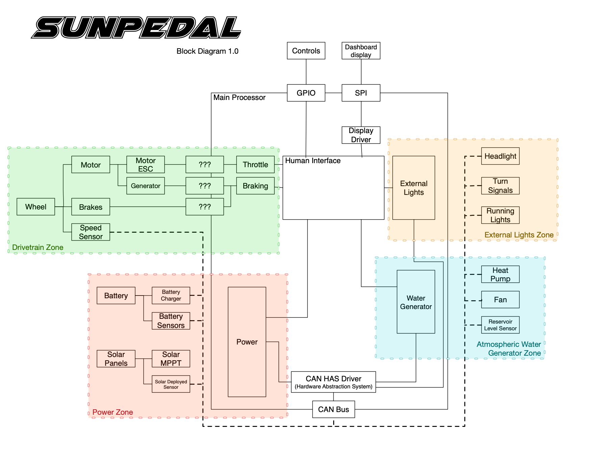

# Exercise 2.1

### Idea project diagram

* Make a block diagram describing an embedded system you’d like to have or make. Be
imaginative. Reality does not apply here.

## SunPedal 

A solar powered survival e-moped capable of taking you anywhere the sun shines, while prioviding drinking water along the way. Cruise to a nice camping spot, unfold the solar panel array, and sit back and sip a refreshing glass of water pulled right out of the air.

Interesting facts:

* You can get about 340W of solar power in 5ft x 3.5ft area.
* Some atmospheric water generators use [310 Wh to make 1 liter](https://time.com/75612/atmospheric-water-generator-watergen/) of water.
* The U.S. National Academies of Sciences, Engineering, and Medicine determined that adults need around [2.7 - 3.7](https://www.mayoclinic.org/healthy-lifestyle/nutrition-and-healthy-eating/in-depth/water/art-20044256) liters of water a day (from food and/or drinks).
* It is surprisingly difficult to find information on what kind of interface a powerful motor controller uses on short notice.

