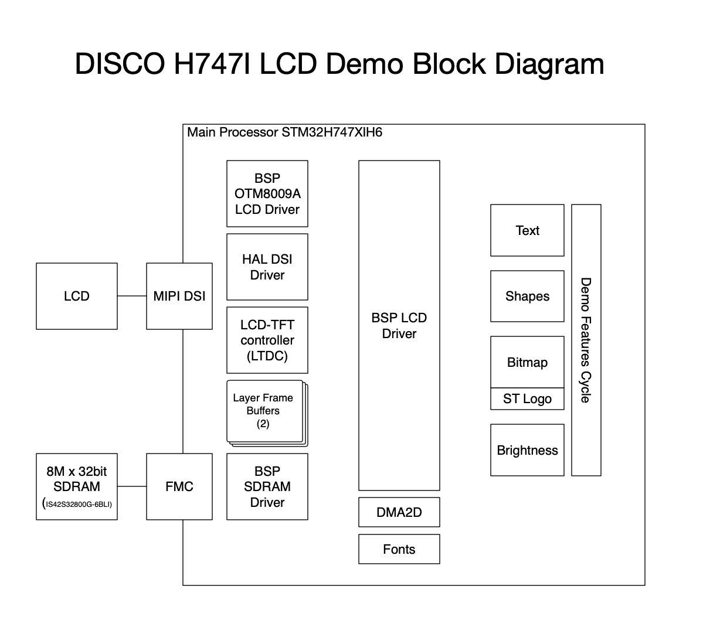

# Exercise 2.2

### Idea project diagram

### Read mbed code, make diagram

* Create a sign in and log into the mbed compiler
* Go to mbed platforms https://os.mbed.com/platforms/
* Select any platform (hint: search for a processor similar to the one you are considering for your final project)
	* Read through the platform page
	* Add to Mbed Compiler (button on right)
	* Load a simple sounding template
	* Create a block diagram for this program, briefly explain why you chose the platform and template you did, be prepared to talk about this board in Live Class

# `DICO_H747I_LCD_demo`

I chose this platform and template since it was one of the few cortex M7 boards listed with an LCD, like the board I'm using for the final project, and wanted to know what working with the LCD looked like.

These come with a BSP (Board Support Package) which is a high level API on top of HAL APIs for the discovery board features.

Notes:

* Drivers have a flag for HDMI support, but I could not find where this define might be set and there is no mention of it in the discovery board manual.
* I found no mention in the code for the second core (M4) in the MCU.
* The BSP LCD file/module is doing a lot: setting up hardware, buffers, and all of the graphics drawing implementation.

