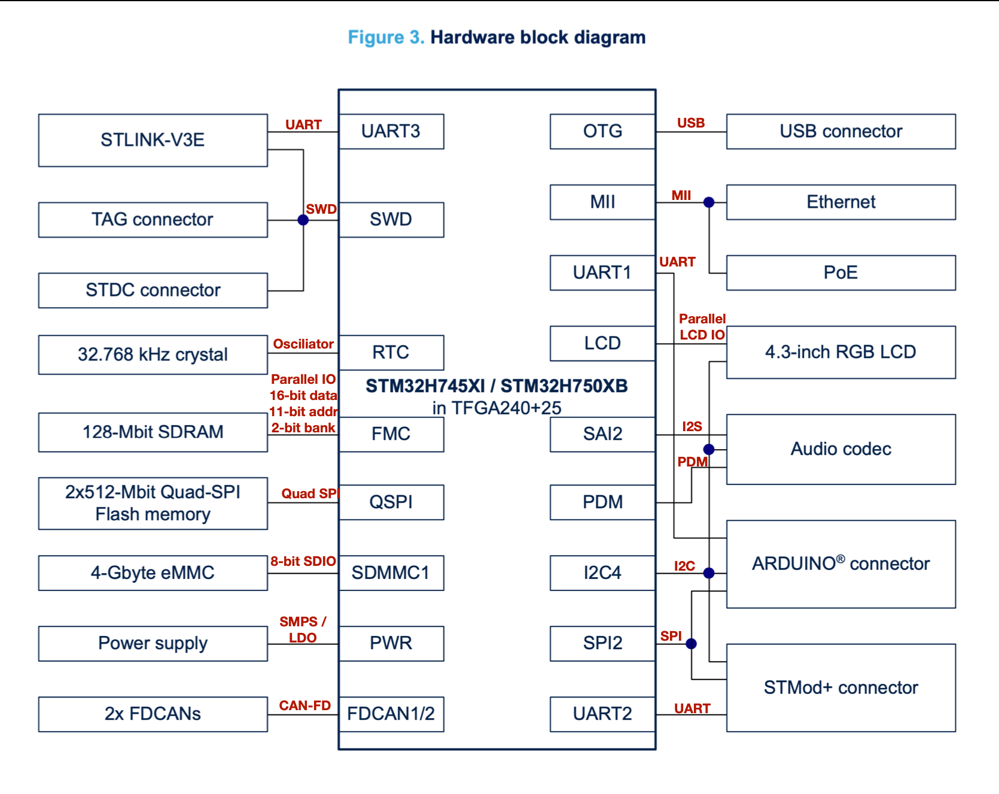

# Investigate project board
Look at the documents for the board you are considering for your final project (or any ST Discovery Board), draw the hardware block diagram for the board. For peripherals, note the communication paths (SPI, I2C, etc). 

Look at the datasheet for the processor and other documents. Answer these questions:

* What kind of processor is it?
* How much Flash and RAM does it have? Any other memory types?
* Does it have any special peripherals? (List 3-5 that you noted as being interesting.)
* Does it have a floating point unit?
* If it has an ADC, what are the features?
Look at one application note for this processor.

# STM32H745I-DISCO

### Block Diagram

A hardware block diagram is already provided for this discovery board. I've added communication protocols (some were more obvious than others).

This discovery board has a lot of hardware and IO. The schematic spans 19 sheets!

### Questions

##### What kind of processor is it?

This is a dual-core Arm Cortex M7 and M4. The M7 has a double-precision FPU, and the M4 has a single-precisions FPU. The M7 runs at up to 480MHz, and the M4 runs at up to 240MHz.

##### How much Flash and RAM does it have? Any other memory types?

* 2MB on-MCU flash in two 1MB banks
* On-MCU RAM:
	* 192K TCM RAM:
		* 64K Instruction TCM
		* 128K Data TCM
	* 864K SRAM
		* 512K AXI SRAM
		* 128K SRAM1
		* 128K SRAM2
		* 32K SRAM3
		* 64k SRAM4
	* 4K SRAM in backup domain
* The M7 core also has an L1 cache: 
	* 16K data 
	* 16K instruction
* The M4 core has a 64 256-bit line cache buffer as part of the ART Accelerator.

In addition to the on-MCU memories, the discovery board adds these memories:

* 2x 512Mbit (128MB total) QSPI NOR Flash
* 4GB eMMC flash
* 128Mbit (16MB) SDRAM 

##### Does it have any special peripherals?

The Flexible Memory Controller (FMC) is interesting in that it can map external memory more or less transparently.

The JPEG codec hardware could be interesting for quickly handling images, either decoding for display (or CV if the camera pre-compresses images), or for compressing.

The DMA2D "Chrome-Art Accelerator" is an interesting image copy and manipulation peripheral. It can copy rectangular subsections of an image to another, blend images together with transparency, and convert between different pixel color formats. This could speed up a composited GUI or be used to implement a game with sprites and tiles.

##### If it has an ADC, what are the features?

This MCU has three 16-bit ADCs. Each ADC connects to up to 20 channels (some may be  shared with other ADCs). They can operate in single-ended or differential mode.

ADC1 and ADC2 can work in dual mode to sample simultaneously, or interleaved with a delay.

All ADCs have a host of ADC goodies including:

* Oversampling option
* Scan a single channel or a sequence of channels
* Single conversion, continuous, or discontinuous (a few each trigger)
* Injected channels (like an interrupt)
* Window watchdogs

There are a lot of other features, but those are the ones that stood out over more common ADC characteristics. 

##### Application note

AN5557 "STM32H745/755 and STM32H747/757 lines dual-core architecture"

This document describes how these cores interact with each other, the power domains, and contains strategies for developing applications.

For example, it is possible to power down either core and run the remainin core to save power. Some capabilities and memories are tied to a specific power domain.

It's recommended to keep graphical and processing heavy workloads on the M7, while the M4 handles peripherals. Applications should be designed to partition tasks in a way that reduces depencies, allows concurrency, and avoids too much overhead from synchronization and/or copying.

There's also mention of various cross-core communication and synchronization methods.

